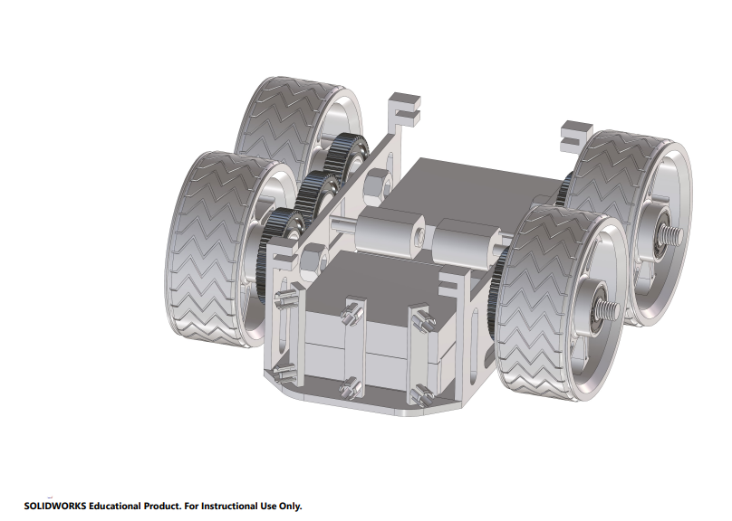
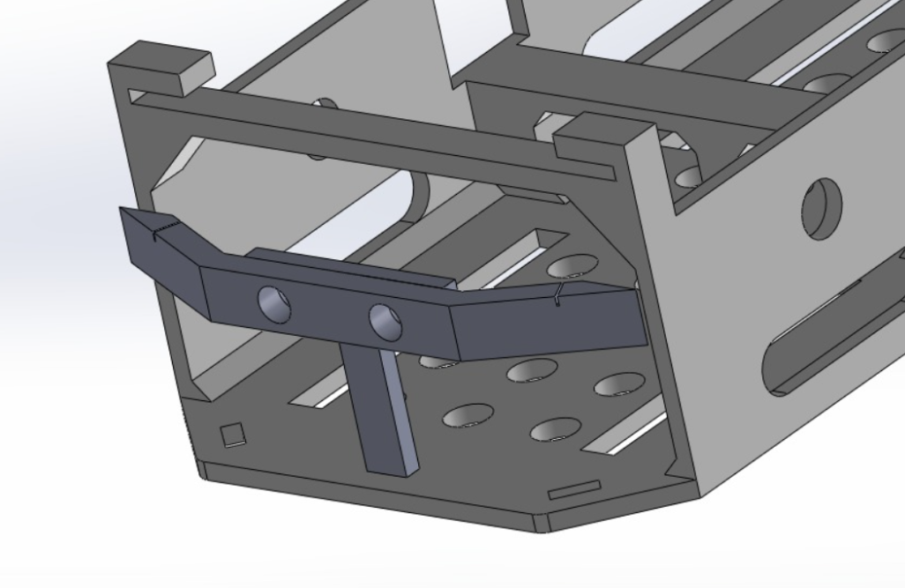
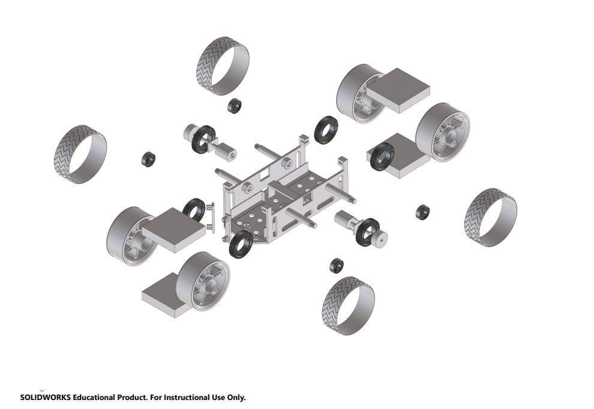
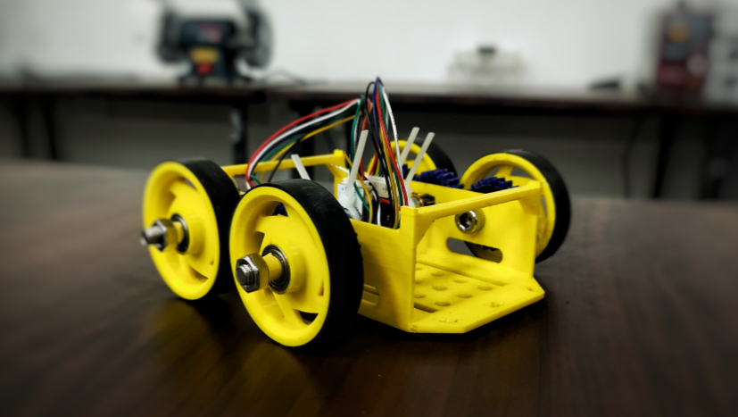
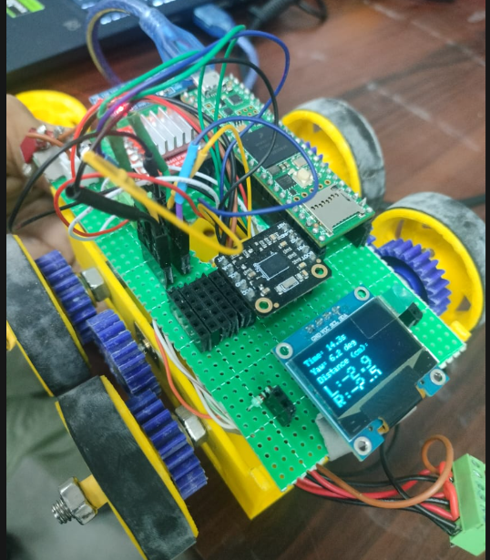
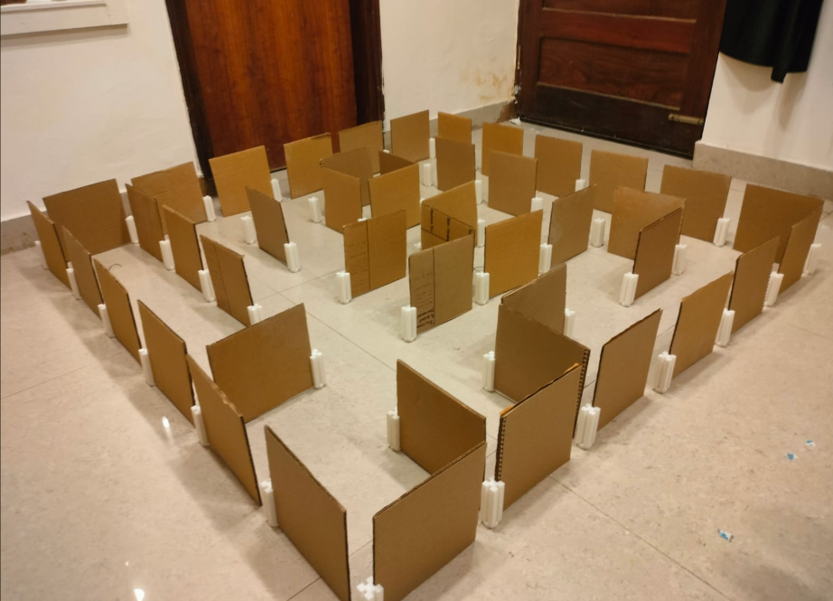
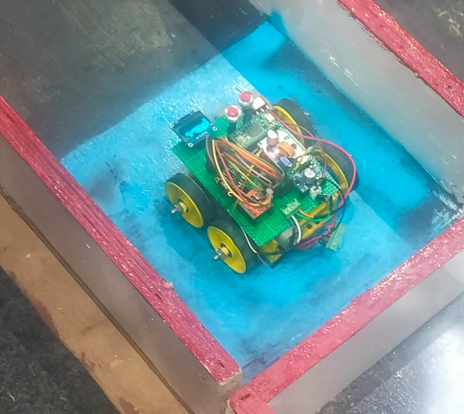
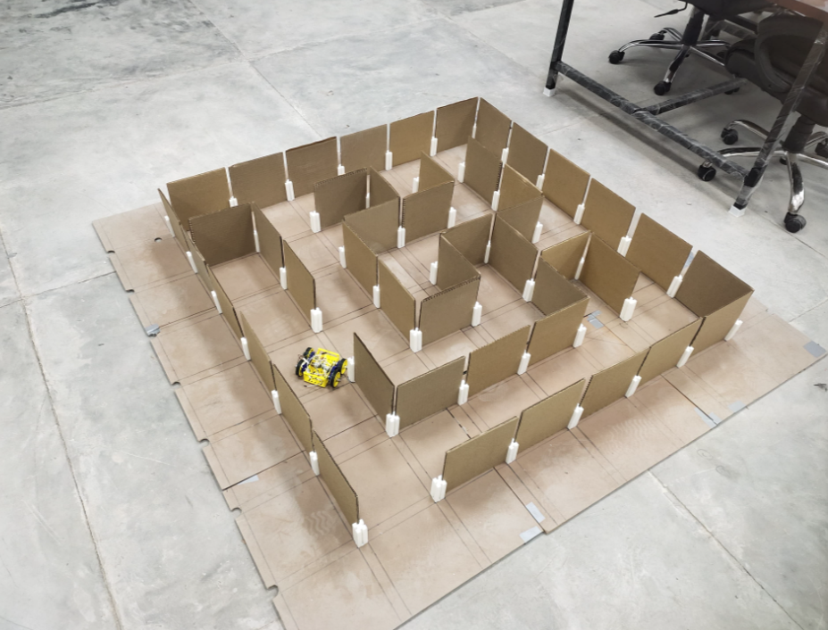

# Maze Solver — TECHNOXIAN

An autonomous maze-solving robot built for the TECHNOXIAN World Robotics Championship. It explores an unknown maze on its own, builds an internal map as it goes, and computes the shortest path back to the goal — the `algorithms/` folder includes flood fill, depth-first search, and breadth-first search implementations, with flood fill used for the actual run.


## What it does

The robot starts with no idea what the maze looks like. As it moves, it reads its wall sensors, updates an internal grid representing what it's discovered, and decides which cell to explore next. Once it's mapped enough of the maze (or reached the goal once), it runs a flood fill pass to work out the shortest route and re-runs that route at speed.

Before any of this went onto real hardware, the algorithms were prototyped and tested in Python and visualized separately, so the maze-solving logic could be debugged without needing the physical robot on hand every time. The robot's motion and sensing are also modeled in a ROS 2 simulation, which made it possible to test navigation behavior in a virtual maze before relying on the physical build.

## CAD & Mechanical Design

The chassis and mounting layout were designed in CAD before any part was cut or printed, so the sensor placement, wheel base, and component spacing could be worked out on screen first.


*Full chassis assembly — top-down and isometric views.*

The design follows a differential-drive layout: two driven wheels on either side, a free-rolling caster (or third wheel) for balance, and the chassis sized to fit comfortably within the maze cell width with enough clearance for turning in place. The microcontroller and motor driver sit on a top deck, with distance sensors mounted at the front and sides so the robot can read walls ahead and to either side of it as it explores.


*Sensor mount positions — front and side-facing sensors for wall detection.*

Key things the CAD process had to account for:

- Sensor field-of-view, so adjacent sensors don't pick up false readings off the maze walls
- Keeping the center of mass low and centered for stable, predictable turns
- Enough room underneath/around the board stack for wiring without obstructing the wheels
- A wheel base tuned for tight in-place turns, since the robot needs to pivot cleanly at each cell


*Exploded view showing how the layers/components fit together.*

CAD files and any associated drawings live in the `hardware/` folder, alongside the part list and assembly notes. The `electronics/` folder covers the circuitry side — power distribution, motor driver wiring, and sensor interfacing — separately from the mechanical design.


*The robot after assembly, matching the CAD design.*

## ROS 2 Simulation

Before relying on the physical robot for every test run, the navigation behavior is validated in a ROS 2 simulation. This lets exploration logic, sensor response, and motion control all get tested against a virtual maze — much faster to iterate on than re-flashing firmware and resetting a physical maze every time something needs checking.

https://github.com/user-attachments/assets/d6f49a7b-e452-4b97-ae6b-94ff88f7cec8

*The simulated robot navigating a virtual maze in the ROS 2 environment.*

What the simulation covers:

- **Robot model** — a simulated version of the differential-drive robot, built to roughly match the real chassis dimensions and sensor placement from the CAD design
- **Virtual maze environment** — a maze world the robot can be dropped into and explore, swappable for different layouts
- **Sensor simulation** — simulated wall/distance sensor readings so the same exploration code that runs on the physical robot can be tested here first
- **Navigation testing** — running the actual exploration and flood-fill logic against the simulated robot to catch mapping or path-planning issues early


This setup means most of the maze-solving logic gets debugged and proven out before it ever touches the physical robot — by the time it's flashed onto hardware, the algorithm itself is already known to work; what's left to tune is mostly sensor calibration and motor response.

To build and run it:

```bash
go through the readme in simulation folder
```


## Software stack

| Part | Tooling |
|---|---|
| Maze-solving algorithms | Python (prototyping), C++ (on-robot) |
| Firmware | C++ |
| Simulation | ROS 2 |
| Visualization | Python |
| Build/setup scripts | Shell |

## Getting started

Clone the repo:

```bash
git clone https://github.com/Mod-Piyush-Goyal/Maze-Solver-TECHNOXIAN-.git
```

To experiment with the algorithm itself before touching hardware, start in `algorithms/` — it's plain Python, so you just need a recent Python 3 install. The `flood-fill-visualization/` folder is the easiest way to actually see what the algorithm is doing on a sample maze.

For the on-robot code, the C++ versions in `algorithms_cpp/` are what actually gets flashed to the microcontroller — check that folder for build/upload instructions specific to the board being used.

## How the solving loop works

1. Read the wall sensors at the current cell
2. Update the internal maze map with whatever was just discovered
3. Pick the next cell to move to (driven by the flood fill values)
4. Move there
5. Repeat until the goal is reached
6. Once the maze is sufficiently explored, recompute the shortest path and run it

## Roadmap

Things I'd like to add next:

- Better sensor calibration / filtering for noisier readings
- PID tuning for smoother turns and straight-line driving
- A second pass at the maze for the fastest possible run, not just the first successful one
- More thorough testing across different maze layouts, not just the competition one

## Gallery

<!-- Drop actual image files into an `images/` folder at the repo root and update the paths below -->

| | |
|---|---|
|  <br> Wiring / hardware setup |  <br> Maze arena |
|  <br> At competition |  <br> Robot in action |

## Contributing

This is mainly a team project for TECHNOXIAN, but if you spot a bug or have an idea, issues and PRs are welcome.
