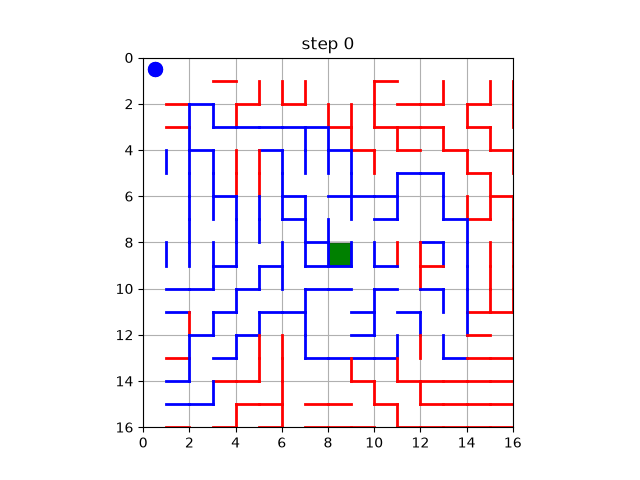
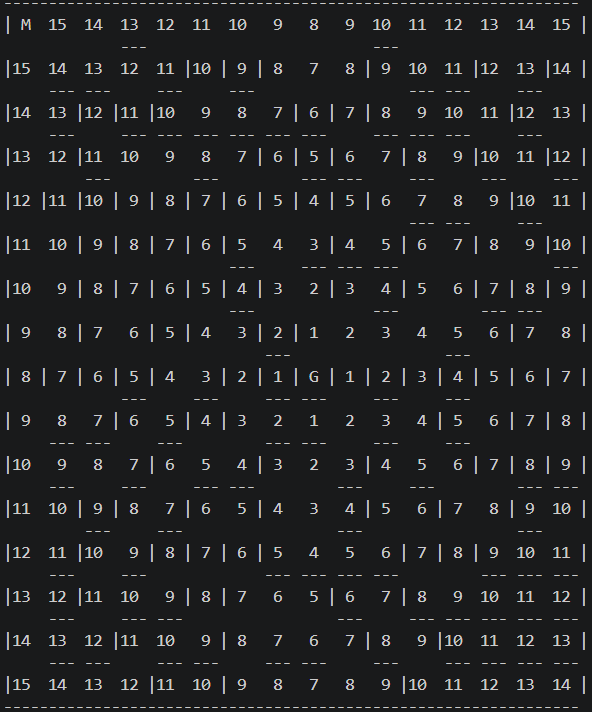
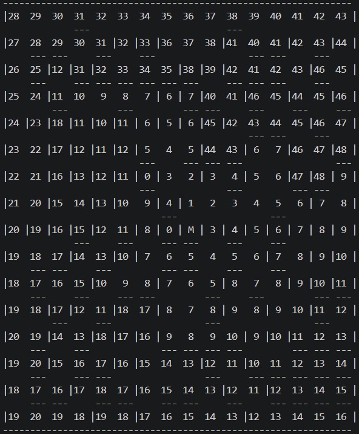
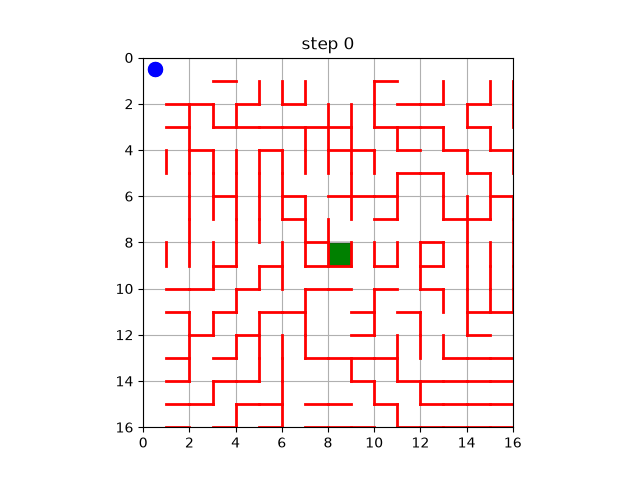

# Maze Solver Project Documentation

## Overview

This project implements a simulated maze-solving robot (mouse) that can navigate a maze using wall detection, pathfinding, and memory of discovered walls. The project is modular and can be extended to real-world robotics applications.

### Micromouse in Action
   <figure style="display:inline-block;margin:0 16px;text-align:center;">
      
      <figcaption><strong>Micromouse Navigating the Maze</strong></figcaption>
   </figure>

<br>
<br>
This README explains the algorithm, key functions and optimizations implemented, and how you can run this on custom mazes of your own.

---

## Mouse Class

### Initialization

**Mouse(x, y, known_walls, goal, known_paths, known_moves)**  
- `x`, `y`: Starting coordinates of the mouse.
- `known_walls`: List of wall tuples known to the mouse.
- `goal`: Tuple `(x, y)` representing the goal cell.
- `known_paths`: List to store all discovered paths.
- `known_moves`: List to store all move sequences.

---

### scan_walls

Scans for walls around the mouse's current position and direction using the lidar module. Updates `self.known_walls` with any new walls found.

---

### move_forward

Moves the mouse one step forward in its current direction and updates its position.

---

### flood_fill

Performs the flood fill algorithm to compute the shortest path distances from the goal to all cells in the maze.

**Returns:**  
A NumPy array representing the maze with distances filled in.

---

### navigate

Navigates the maze from the current position to the goal using the flood fill algorithm. Tracks the path, moves, and walls discovered at each step.

**Arguments:**
- `maze`: The maze as a NumPy array.
- `reverse`: If `True`, reverses the path and moves at the end.

**Behavior:**
- At each step, the mouse chooses the adjacent cell with the lowest flood fill value that is not blocked by a wall.
- The mouse updates its direction and scans for new walls as it moves.
- The mouse records its moves, positions, and the set of known walls at each step for later analysis or visualization.

---

### optimize_and_memorize

Removes loops from the path (when the same position is reached again) and stores the optimized moves and positions.

**Arguments:**
- `moves`: List of moves taken.
- `positions`: List of positions visited.

---

### reverse

Given the path taken from goal to starting point, determines the path from starting point to goal.

**Arguments:**
- `moves`: List of moves taken.
- `positions`: List of positions visited.

**Returns:**  
Tuple of (reversed moves, reversed positions).

---

### segmentize

Segments the path into straight segments based on direction changes.

**Arguments:**
- `moves`: List of moves taken.
- `path`: List of positions visited.

**Returns:**  
List of segments (each segment is a list of positions).

---

## Maze Representation

- The maze is represented as a 2D NumPy array.
- Walls are represented as tuples of cell pairs, e.g., `((x1, y1), (x2, y2))`.
- The mouse maintains a list of known walls and updates it as it discovers new walls using simulated lidar.

---

## Flood Fill Algorithm

- The flood fill algorithm is used to compute the shortest path from any cell to the goal.
- The mouse uses this information to decide its next move at each step.

---

## Wall Detection

- The mouse uses a simulated lidar (`scan`) to detect walls in its current direction.
- Newly discovered walls are added to the mouse's memory.

---

## Path Memory

- The mouse records all moves and positions during navigation.
- After reaching the goal, it can optimize the path by removing loops and store the optimized path for future use.

## Path Class and Diagonal Compression

The `Path` class (see `algorithms/path.py`) encapsulates a recorded navigation and computes metrics useful for comparing candidate routes:

- **Constructor:** accepts `positions` (visited coordinates) and `moves` (direction steps).
- **Fields:** `positions`, `moves`, `turns`, `length`, `optimized_length`, `optimized_turns`, `feasibility_score`.
- **`calculate_turns(moves)`:** counts direction changes. Each change increments the count by 2 (modeling two 45° turns per 90° change).
- **`optimize_length_and_turns()`:** applies a diagonal compression heuristic that replaces alternating orthogonal move patterns with diagonal moves when possible. Concretely, it searches for repeating patterns of the form A, B, A (A and B orthogonal). Each detected streak `s` of such patterns updates the length and turns as:

$$
L_{opt} = L - 2s + s\sqrt{2}
$$

$$
T_{opt} = T - 4s + 2
$$

where $L$ and $T$ are the original move length and turn count, and $L_{opt}$ and $T_{opt}$ are the optimized values. This models replacing two axis-aligned steps (and their associated turns) with a single diagonal traversal.

- **`calculate_feasibility_score()`:** uses `regression.regress()` to obtain weights and an intercept, estimates a time-cost as a linear function of `optimized_length` and `optimized_turns`, and returns the inverse (higher is more feasible).

---

## Extensibility

- The project is modular and can be extended to support different maze sizes, wall layouts, and real-world robotics hardware.
- The algorithms are designed to be adaptable for both simulation and physical robots.

---

## How to Use

1. **Update the Walls Array**: 
   - Open the `lidar.py` file.
   - Locate the `get_walls` function. This function defines the walls in the maze as a list of tuples representing blocked paths. For example, `((4, 0), (4, 1))` represents a wall between squares `(4, 0)` and `(4, 1)`.
   - Update the `walls` array within the `get_walls` function to create your own maze. Each wall should be defined as a tuple of tuples, where each inner tuple represents a coordinate in the maze.

2. **Update the Start and Goal Points**:
   - Open the `main.py` file.
   - Locate the `main` function. This function sets the start and goal points for the mouse.
   - Update the `mouse` initialization to set the start point and the `goal` variable to set the goal point.

3. **Run the Script**:
   - Open a terminal or command prompt.
   - Navigate to the directory containing the `main.py` file.
   - Run the script using the following command:

     ```bash
     python main.py
     ```

4. **Observe the Output**:
   - The script will print the mouse's movements and the walls it encounters.
   - The mouse will navigate the maze and print the number of moves it took to reach the goal.
   - The mouse will perform 4 runs (forward, backward, forward, backward) and store the runs as GIFs in the /maze_runs folder.

   ## Visualizations

   ### Flood Fill Images

   <!-- <p align="center">
      
      
   </p> -->
   <p align="center">
      <figure style="display:inline-block;margin:0 16px;text-align:center;">
           
         <figcaption><strong style="font-size: 11px;">Flood-filled maze as seen my the micromouse at the beginning</strong></figcaption>
      </figure>
      <figure style="display:inline-block;margin:0 16px;text-align:center;">
           
         <figcaption><strong style="font-size: 11px;">Flood-filled maze as seen my the micromouse after exploration</strong></figcaption>
      </figure>
   </p>

   These two images show the flood-fill values: Greater number signifies greater distance from the goal. G represents the Goal, while M represents the Micromouse.

   ### Example Runs

   <p align="center">
      <figure style="display:inline-block;margin:0 16px;text-align:center;">
           
         <figcaption><strong>Initial forward run</strong></figcaption>
      </figure>
      <figure style="display:inline-block;margin:0 16px;text-align:center;">
           
         <figcaption><strong>Forward run after some exploration</strong></figcaption>
      </figure>
   </p>

   - **Note:** Blue walls in the GIFs are walls that have been discovered. The red walls are yet undiscovered. You can see the red walls turn blue as the micromouse discovers them. Notice how the micromouse makes a wrong turn in the initial run, but corrects it after having explored the maze in subsequent runs.

Feel free to modify the `walls` array in the [lidar.py] file and the start/goal points in the [main.py] file to create your own custom mazes and test the mouse's navigation capabilities.